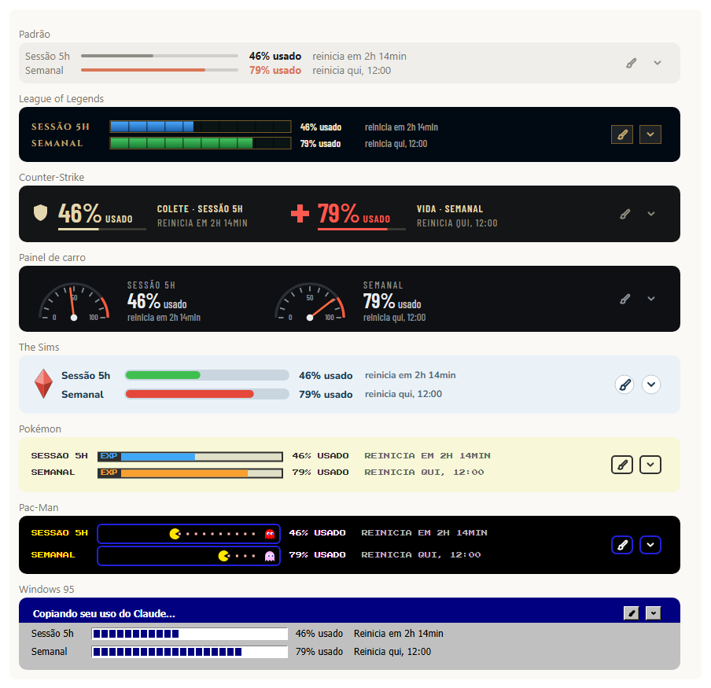
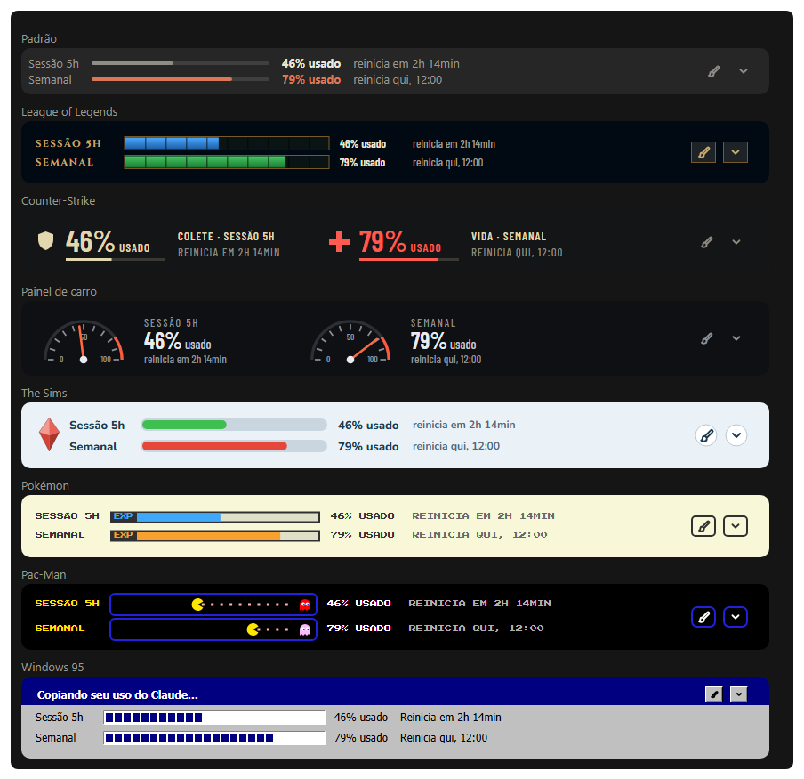

# Usage Mod

**Português** · [English](#english)

Uma faixa logo acima da caixa de chat do **app desktop** do Claude Code que mostra quanto você já **usou** da janela de **5 horas** e da janela **semanal** do seu plano, e quando cada uma **reinicia**. Com 8 personalizações.



Os números são os mesmos da tela de uso do Claude: vêm do próprio Claude Code, então aparecem numa conta de assinatura (Pro/Max) depois da primeira resposta da conversa.

## Instalar

Requer o **app desktop** do Claude (aba Code). No terminal o mod não desenha nada: a ideia é ter o uso à vista no app, sem abrir a tela de uso.

**Pelo app (sem terminal):** abra uma conversa no Code e cole esta mensagem para o Claude:

> Instale o plugin do Claude Code `usage-mod`: adicione o marketplace do GitHub `speranzapedro/usage-mod` e instale `usage-mod@pedro-mods` (escopo de usuário), usando o comando `claude plugin` (no app, o executável está na variável de ambiente `CLAUDE_CODE_EXECPATH`).

Ele roda os dois comandos e avisa quando terminar. Depois **feche e abra o app**, abra uma conversa nova e mande uma mensagem: a faixa aparece.

**Pelo terminal** (se você tem o comando `claude`):

```bash
claude plugin marketplace add speranzapedro/usage-mod
claude plugin install usage-mod@pedro-mods
```

**Atualizar** quando sair versão nova (não é automático): peça ao Claude no app "atualize o plugin `usage-mod@pedro-mods`", ou rode `claude plugin update usage-mod@pedro-mods`, e reinicie o app.

**Remover:** peça "desinstale o plugin `usage-mod`", ou rode `claude plugin uninstall usage-mod`.

## Como usar

- **Pincel**: abre o menu de personalização (clique na miniatura ou no nome).
- **Setinha**: esconde a faixa; fica só um "▴ uso" no rodapé do chat para trazê-la de volta.
- `/uso`: mostra ou esconde a faixa.
- `/uso-tema <nome>`: troca a personalização: `padrao`, `lol`, `cs`, `carro`, `sims`, `pokemon`, `pacman`, `win95`.

A personalização escolhida e o estado escondido ficam salvos entre as conversas.

## Personalizações

Padrão, League of Legends, Counter-Strike, Painel de carro, The Sims, Pokémon, Pac-Man e Windows 95. Todas dizem o mesmo, do mesmo jeito: quanto de cada janela já foi **usado** e quando ela **reinicia**.

Cada personalização pinta a faixa inteira, com cantos arredondados como os da caixa de chat, no tema claro e no escuro. As fontes vão embutidas nos desenhos, então fica igual em qualquer computador.



## Privacidade

O mod não acessa a internet, não lê nem grava arquivos e não coleta nada. Ele só:

- lê os limites de uso que o próprio Claude Code já tem (`$.session.usage()`);
- guarda, no armazenamento do Claude Code para plugins, duas preferências: a personalização escolhida e se a faixa está escondida.

Você pode conferir: o código está todo em `hooks/`, e `claude plugin validate .claude-plugin/plugin.json` lista cada chamada que o mod faz.

## Avisos

Projeto pessoal, sem fins lucrativos e sem relação com a Anthropic. League of Legends, Counter-Strike, The Sims, Pokémon, Pac-Man e Windows são marcas dos seus donos; os desenhos foram feitos para este mod, inspirados no estilo de cada jogo, e o mod não tem relação com essas empresas.

**Limite conhecido.** Para pintar a moldura que o app Desktop desenha em volta da faixa, o mod usa medidas tiradas do app atual no Windows: margens de 9px à direita e 10px embaixo, e as cores de fundo da página nos temas claro e escuro. Se outra versão do app (ou o app no Mac) usar outras medidas, pode aparecer uma lasca na borda, um canto de outra cor ou um pixel de rolagem. Os números e os botões continuam funcionando. Os valores ficam em `RIGHT_MARGIN` e `BOTTOM_MARGIN` (`hooks/register.js`) e na constante `PAGE` (`hooks/themes.js`).

## Para quem mexe no código

- `hooks/register.js`: lê os limites e desenha a faixa.
- `hooks/themes.js`: o desenho de cada personalização (funções puras).
- `hooks/fonts.js`: as fontes, reduzidas aos caracteres usados e renomeadas, em base64 (gerado por `tools/fetch_fonts.py`, que chama `tools/rename_fonts.py`).
- `tools/preview.mjs`: `node tools/preview.mjs` gera `tools/preview.html` com todas as personalizações em três níveis de uso, e as páginas das imagens deste README.
- `tests/`: rode `claude plugin test` nesta pasta.

Para testar mudanças sem reinstalar, aponte o Claude Code para a pasta com a variável de ambiente `CLAUDE_CODE_PLUGIN_DIRS` (e `CLAUDE_CODE_PLUGIN_DIR_WATCH=1` para recarregar ao salvar). Não deixe o mod instalado pela loja ao mesmo tempo, ou ele carrega duas vezes.

## Licença

Código sob a licença MIT (`LICENSE`). As fontes embutidas seguem a SIL Open Font License 1.1 (`FONTS-LICENSE.md`).

---

<a id="english"></a>

## English

A band right above the chat box in the Claude **desktop app** (Code tab) showing how much of your plan's **5-hour** and **weekly** windows you have **used**, and when each one **resets**. With 8 personalizations (the band's text is in Portuguese).

**Install** (Claude desktop app, Code tab; the mod draws nothing in a terminal). In a Code conversation, ask Claude:

> Install the Claude Code plugin `usage-mod`: add the GitHub marketplace `speranzapedro/usage-mod` and install `usage-mod@pedro-mods` (user scope) with the `claude plugin` command (in the app, the executable is in the `CLAUDE_CODE_EXECPATH` environment variable).

Then restart the app and open a new conversation. From a terminal with the `claude` command:

```bash
claude plugin marketplace add speranzapedro/usage-mod
claude plugin install usage-mod@pedro-mods
```

Update with `claude plugin update usage-mod@pedro-mods` (updates aren't automatic); remove with `claude plugin uninstall usage-mod`.

**Use**: the brush opens the personalization menu; the chevron hides the band, leaving a small "▴ uso" in the chat footer to bring it back. `/uso` shows or hides it; `/uso-tema <name>` picks a personalization (`padrao`, `lol`, `cs`, `carro`, `sims`, `pokemon`, `pacman`, `win95`). The numbers are the ones on Claude's usage screen, available on Pro/Max plans after the conversation's first reply.

**Privacy**: no network access, no file access, no data collection. The mod only reads the usage limits Claude Code already has and stores two preferences (the chosen personalization and whether the band is hidden) in Claude Code's plugin storage. `claude plugin validate .claude-plugin/plugin.json` lists every call it makes.

**Notes**: a personal, non-commercial project, not affiliated with Anthropic. The game names are trademarks of their owners; the drawings were made for this mod, inspired by each game's style. To paint over the frame the Desktop app draws around the band, the mod uses measurements taken from the current Windows app; another app version (or macOS) may show a 1px sliver, an off-color corner or a pixel of scrolling. The numbers and buttons keep working.

**License**: code under MIT (`LICENSE`); the embedded fonts under the SIL Open Font License 1.1 (`FONTS-LICENSE.md`).
